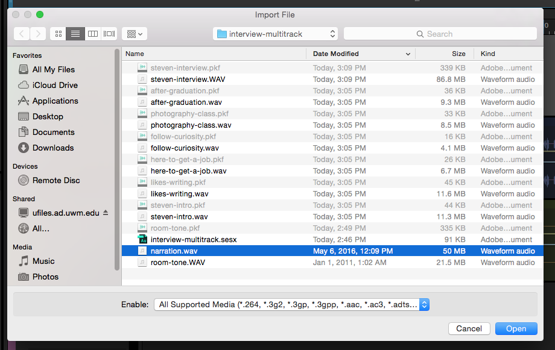

# Adding Narration to Your Project

\(If your story does not include narration, skip this step.\)

If you’re working on a project that requires narration, you can create sound bite WAV files from your narration WAV file using the Waveform Editor. You can add the narration sound bite WAV files to audio tracks in your Multitrack Session.

1. Copy your narration WAV files into your project folder.
2. Import your narration WAV files into Audition.
3. In the Files panel, double-click a WAV file to open it in the Waveform Editor.
4. Add Range Markers to the sections of the WAV file that you would like use in your project. Give your Range Markers appropriate names in the Markers panel. \(Follow file and folder naming conventions.\)
5. Export the audio of your Range Markers to your project folder.
6. Import your sound bite WAV files into Audition.
7. Switch back to your Multitrack Session.
8. Add your sound bite WAV files to tracks in your Multitrack Session.

