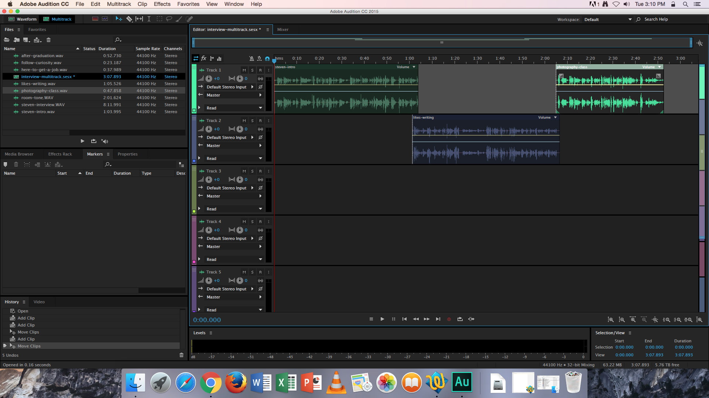

# Adding Sound Bite WAV Files to Tracks

1. Click and drag a sound bite WAV file from the **Files** panel into an audio track. 
2. To position a sound bite in the audio track, click and drag its **titlebar** \(bar at top of sound bite.\) Be sure the first sound bite is flush with the start of its audio track.   
3. The sound bites of each interviewee should occupy two audio tracks. Stagger the sound bites between the first and second audio tracks—alternating between both.
4. The pad at the end of a sound bite should slightly overlap the pad at the beggining of the next sound bite. [Zoom in](../listening-and-logging/zooming-in-out.md) to adjust the sound bites.

