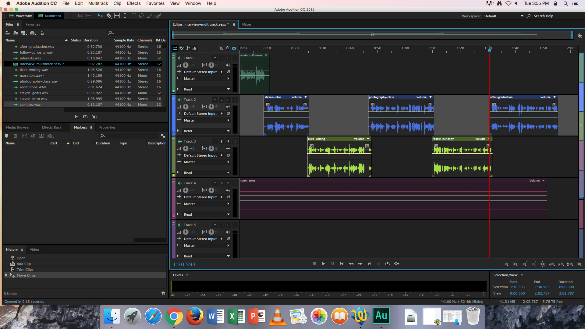

# Moving Multiple Sound Bites

Occasionally, it may be necessary to move several sound bites at the same time.

1. In the Multitrack Session, Zoom Out as far possible.
2. Drag-select all of the sound bites you want to move \(be careful not to accidently click and drag any individual sound bites while doing this.\) All of the sound bites should appear selected.
3. Click and drag the green title bar of one of the selected sound bites to move them as a group.

