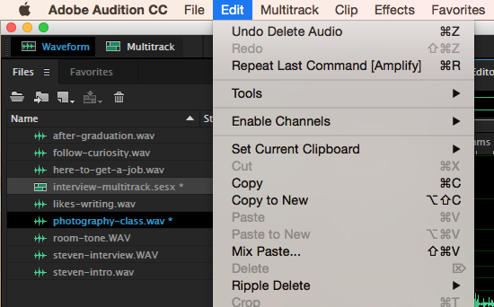

# Using Undo and the History Panel

If you go overboard with amplitude adjustments or deletions, you can step back in time using **Undo** and the **History** panel.

* Go to to **Edit** on the menu bar and select **Undo**.
* Use the **History** panel \(lower-left\) to step back to a specific point in time.

