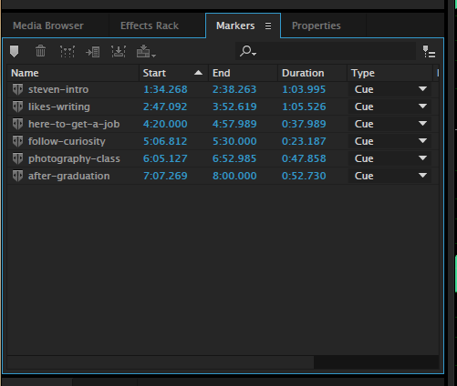

# Adding Range Markers to a WAV File

As you listen to your audio file, you’ll probably find yourself thinking, “I want to use this sound bite in my project—it’s a keeper.” To make a note of that keeper sound bite, you’ll add a **range marker** to your WAV file.

Adding **range markers** to WAV files is an essential part of the JAMS audio editing workflow. Later, you’ll use your **range markers** to create sound bite WAV files that will be added to audio tracks in your multitrack session.

1. While in the waveform editor, click the **Markers** tab \(left panel.\)
2. Hover your **mouse pointer** in the waveform ****area. Your **mouse pointer** will appear as an **I-beam pointer**.
3. To add a **range marker** to your WAV file, click and drag from just before the start of your keeper sound bite area until slightly after the end of it. \(This extra audio at the beginning and end of your keeper sound bite is pad. It will be useful later.\) Your keeper sound bite area will appear highlighted.
4. With your keeper sound bite area highlighted in the waveform, click the **Add Cue Marker** button in the **Markers** panel \(left panel.\) This will add a **range marker** \(probably named **Marker 01**\) to your WAV file.
5. In the **Markers** panel, click the name of the range marker \(probably **Marker 01**\) and give it a better name \(use something that will help you remember its content.\) Follow [file and folder naming conventions](https://jjloomis.gitbooks.io/file-and-folder-management/content/file-and-folder-naming-conventions.html).
6. Repeat this process to add **range markers** to all of the keeper sound bites in your WAV files.

