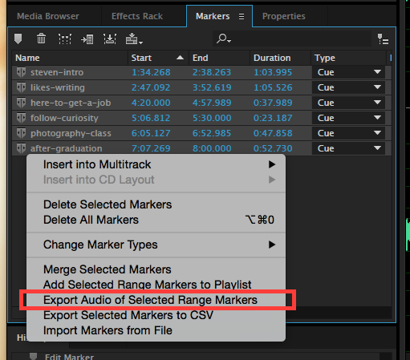

# Exporting Audio of Range Markers

After saving your WAV file, you’ll export the audio of your **range markers** to your project folder. This process uses the audio within your **range markers** to create sound bite WAV files in your project folder.

1. In the **Markers** tab \(left panel\), click the top range marker to select it. 
2. Press and hold the **Shift** key \(on keyboard.\)
3. While holding the **Shift** key, click the bottom range marker. All of the **range markers** in the Markers tab will become highlighted. \(With all of the Range Markers selected, you can let go of the **Shift** key.\)
4. Press and hold the **Control** key \(on keyboard\), and click within the highlighted **range markers**.
5. From the fly-out menu, choose **Export Audio of Selected Range Markers**. 
6. In the Export Audio Range dialog box, click the **Browse** button. Navigate to and select your project folder.
7. Click the **Export** button. The audio from your **range markers** will be saved as sound bite WAV files in your project folder.

