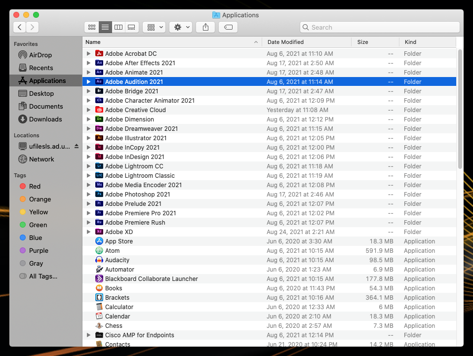

# Opening Audition

1. Using a JAMS Lab or CCL Mac, click the **Desktop** to enter **Finder** mode.
2. Click **Go** on the menu bar and select **Applications**.
3. In **Applications**, open **Adobe Audition CC 2021**. 

