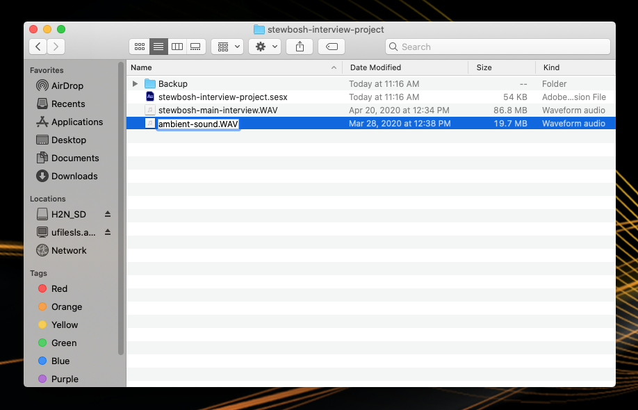

# Previewing and Renaming WAV Files

Before importing your WAV files into Audition, you'll preview and rename them. 

1. Right-click a WAV file in your project folder and select **Play** in the fly-out menu. The audio file will play in VLC. 
2. Listen to the WAV file to get a sense of its content. 
3. Close VLC and rename the WAV file in your project folder \(Control-click the WAV file and select **Rename** in the fly-out menu.\) **Important**: Be sure to maintain the **.WAV** extension at the end of the file name. Also, be sure to follow [JAMS file and folder naming conventions](https://techresources.gitbook.io/file-and-folder-management-mac-os-edition/file-and-folder-naming-conventions). 

